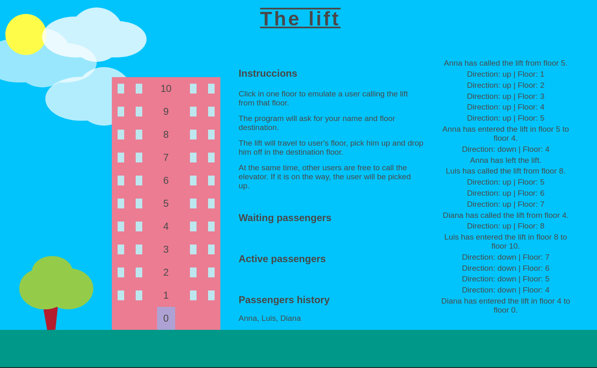

## THE LIFT

<p align="center">
  
</p>

A traditional lift where multiple people could call it from any floor. The floor will pick the users up and drop them off in the selected floor.
The aim of this project is to demonstrate the asynchrony of Node, and then was traslate it to the DOM.

### **Features**

- The user clicks in one floor to emulate a user calling the lift from that floor.
- The program will ask for name and floor destination.
- The lift will travel to user's floor, pick him up and drop him off in the destination floor.
- At the same time, other users are free to call the elevator. If it is on the way, the user will be picked up.

### **Setup**
---
If you’d like to view my project in your browser:

- Clone the repository in your computer, you can type the following command in your terminal
```bash
git clone https://github.com/diana-moreno/the-lift.git
```
- Open the folder.
- Open index.html
- Otherside, you can run the project here: https://diana-moreno.github.io/the-lift/


### **What I learned**

- Draw basic elements with CSS like a tree, building, sun, clouds.
- Animate an element to make move it side to side.
- Demonstrate the DOM and Node's asynchrony (due to the asynchrony, when the lift is managing several passengers at the same time, is processing more stuff in the same second, so in DOM, I couldn't fix that the elevator went faster).